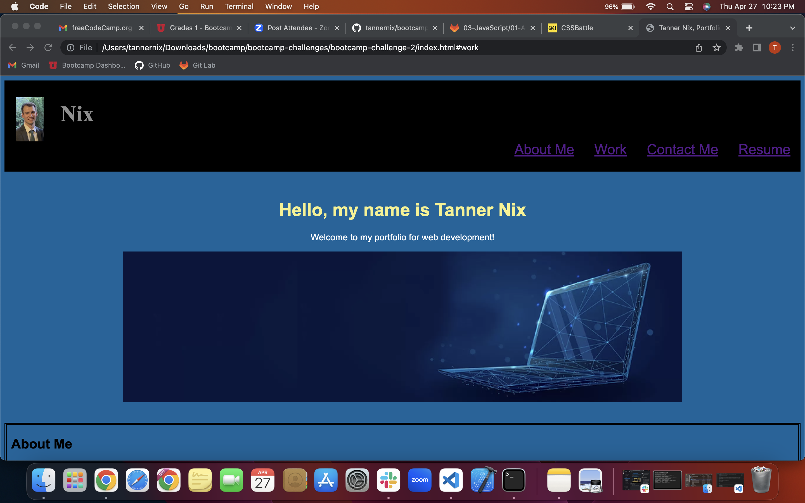

# bootcamp-challenge-2

The second homework assignment to create a portfolio for myself.
 

## Description

This new project was definetly an up and down project. Starting from scratch was new for me so it had its headaches in the start, and middle, and end. lol. But overall I feel I accomplished quite a bit through this. This project was to create a portfolio for myself from scratch, using mainly html and css. I imagined a wireframe of what it was gonna look like and was able to build it to how I wanted. Puting my image in the small left hand side of the screen with my last name I really liked. It also goes through my projects, which I have not done any yet besides this one, so they all link to various other websites. Overall I would say I am proud of what I have accomplished and will be changing this throughout my coding career to implant my future projects and make it look nicier and include javascript as well in the future. Lastly, I will say I talked with the TA and they said my name for my file is just fine and they also helped me with the screenshot that I have in the Usage, they also helped me link my images to the page correctly. Thank you.

## Usage

This website provides a great multiple of use from companies looking to hire me and to also showcase my skills as a webdeveloper. 

## Credits

These are my links to websites and images that I used in my portfolio.

src="https://www.ishir.com/wp-content/uploads/2021/06/Custom-dimensions-670x450-px-Custom-dimensions.jpeg"
href="https://www.google.com/"
href="https://www.bing.com/"
href="https://www.amazon.com/ref=ap_frn_logo"
href="https://www.microsoft.com/en-us/download/internet-explorer.aspx"
href="https://www.apple.com/"

## License

Open for anyone to see, but only my self can update and change things.